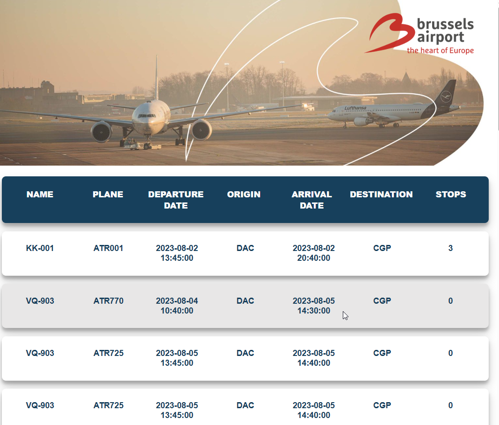

# ✈️ Flight Information

> A simple flight information display inspired by Brussels Airport's website. Built with **HTML**, **CSS**, and **JavaScript**.

## 📑 Table of Contents

- [General Info](#general-info)
- [Screenshots](#screenshots)
- [Technologies](#technologies)
- [Setup](#setup)
- [Code Examples](#code-examples)
- [Features](#features)
- [Project Status](#project-status)
- [Inspiration](#inspiration)
- [Contact](#contact)

---

## General Info

Flight Information is a web application that displays flight data. It sorts and organizes flights by their departure date and time. The project uses JavaScript to dynamically render flight details and DOM manipulation for updating the interface.

---

## Screenshots



---

## Technologies

- HTML5
- CSS3
- JavaScript (Vanilla)
- Node.js
- Visual Studio Code (IDE)

---

## Setup

1. Clone this repository:

   ```sh
   git clone https://github.com/boba-milktea/flight-information.git
   ```

2. Navigate to the project folder:

   ```sh
   cd flight-information
   ```

3. Open `index.html` in a browser.

4. Run tests (optional):

```sh
npm install
npm test
```

## Code Examples

```js
export const sortFlights = (arr = []) =>
  [...arr].sort(
    (a, b) => new Date(a.departureDate) - new Date(b.departureDate)
  );
```

## Features

- Display flight information dynamically
- Sort flights by departure date and time
- Responsive layout inspired by Brussels Airport

## To-Do List

- Add real-time API integration
- Implement search and filter functionality

## Project Status

Project is: Done

## Inspiration

Design Inspired by Brussels Airport.

## Contact

By [boba-milktea](https://github.com/boba-milktea)
